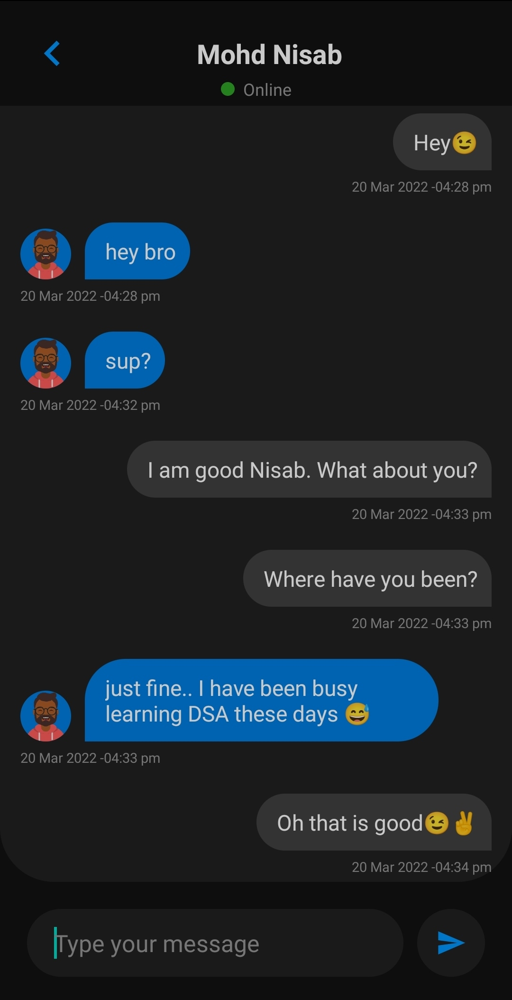

# ChitChat

An Android chatting application made with **Android Studio** and **Firebase**. 
It uses **Firebase Cloud Messaging** and **Firestore** for real-time chat implementation.

## FEATURES
- ***One-to-one chatting***
- ***Email authentication***
- Clean dark theme
- ***Notifications*** for messages

## SCREENSHOTS

  

   
  
  
  
  

## WHAT I HAVE LEARNT
- ***Firebase authentication***
- ***Firestore***
- UI design and styling
- Recycler View with multiple view types
